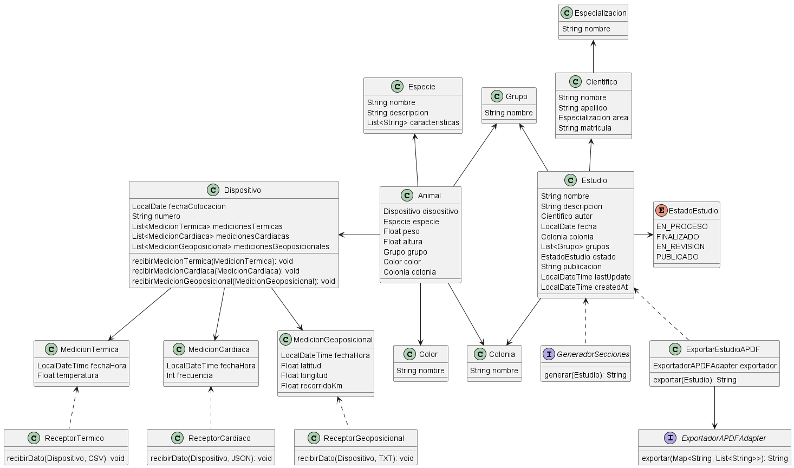

# Arquitectura
### Integración entre el Sistema y Dispositivos/Sensores
En un principio se podría optar por la implementación sincrónica, debido a que la cantidad de individuos que se evalúan
no es demasiado grande, además de que los tiempos entre que se recibe un dato y otro de un mismo dispositivo son muy largos.
Por lo que sería una implementación simple y sencilla, pero el problema surgiría al crecer mucho más el volumen de animales
pudiendo ocurrir que me lleguen demasiados datos a procesar al mismo tiempo.

Por este motivo considero que la mejor implementación sería la asincrónica, para ahorrarme problemas a futuro. Donde utilizaría
una cola de mensajes para que un Consumidor vaya procesando los mensajes de la cola a medida que esté disponible.
El mecanismo de esta integración sería push based, debido a que son los sensores quienes me envían los datos.
El sistema no requiere ir a buscarlos, salvo tal vez para el Sensor Geoposicional, pero los demás son push based 100%

### Científicos y auditores
Podríamos resolver el problema implementando un SSO, idealmente uno existente como puede ser el de Google para ahorrarnos el esfuerzo
de construir uno propio, y manteniendo una seguridad garantizada.

De esta forma, los científicos podrían utilizar una misma cuenta de Google para autenticarse tanto en nuestro sistema como en el componente externo

### Aplicación móvil
- Aplicación nativa:
  - Performance: No habría alguna ventaja en particular, si bien está más optimizado para el dispositivo, al depender de datos de una API REST que vamos a tener que exponer, queda dependiente del tiempo de respuesta, por lo que no tiene la mejor performance, sería la misma que la de una aplicación híbrida con cliente pesado
  - Mantenibilidad: Es la más complicada de mantener debido a que se deben actualizar tanto la versión de Android como de IOS ante cualquier cambio de la app, porque cada uno resulta un software diferente.
- Aplicación híbrida con cliente liviano:
  - Performance: Es la que brinda una mayor velocidad en la obtención de los datos a mostrar, debido a que tiene los componentes mucho más cerca, y no depende del tiempo de respuesta de una solicitud HTTP. Por lo que resulta la más rápida de las 3 alternativas
  - Mantenibilidad: Resulta la más complicada de mantener, dado que se enccuentra tanto la lógica visual como del sistema/negocio en una misma app, resultando en un alto acoplamiento y haría más dificil incluso poder escalar a futuro. Además de que si necesito un cambio sencillo en la app necesito desplegar nuevamente toda la app
- Aplicación híbrida con cliente pesado:
  - Performance: Tendría la misma o equivalente a la de la aplicación nativa, debido a que cuenta con la misma dependencia del tiempo de respuesta de la API
  - Mantenibilidad: Al ser una aplicación híbrida nos libramos del problema de mantenibilidad de la app nativa, porque sólo necesitamos un desarrollo y el mismo se compila para cada SO. Además resulta en un muy bajo acoplamiento con la lógica del sistema/negocio, por lo que es más mantenible que las 2 alternativas anteriores

Dado lo mencionado de cada alternativa, considero que la aplicación híbrida con cliente pesado es la mejor opción

# Modelo de Dominio

### Justificaciones
- Manejo clases de Receptores (Termico, Cardiaco y Geoposicional) para procesar los datos que me envíen los sensores y convertirlos en las respectivas clases de Medición Térmica, Cardiaca y Geoposicional
- Mi clase Dispositivo se encargará de almacenar todas las mediciones que se realicen a lo largo del tiempo. Respecto al animal que lo tiene puesto
- Si bien se menciona que los colores están predefinidos por el sistema, considero que es un dato que podría sufrir cambios por lo que se facilita el tenerlos en una clase para abarcar los nuevos colores que se podrían llegar a agregar al sistema
- Almaceno un atributo `publicacion` en `Estudio` porque así la propia entidad conoce dónde está publicado el estudio
- Por cuestiones de trazabilidad y auditoría agrego los atributos lastUpdate y createdAt en Estudio
- Utilizo el patrón Strategy para la generación de secciones, que si bien no se ven las clases concretas (no se conocen) quien consumiría las estrategias sería la capa de Controllers
- Utilizo el patrón Adapter para la exportación de Estudios a PDF de forma que desacoplo esa lógica que podría depender de alguna librería en particular

# Persistencia

### Justificaciones
- Las correspondientes listas de mediciones adquieren FK hacia Dispositivo para resolver el OneToMany
- Se genera una tabla de Caracteristicas, sin PK debido a que es un mapeo que sólo se hace para resolver el impedance mismatch de tener una lista de primitivos en Especie, se mapearía con un @ElementCollection
- Se crea una entidad Estudio_Trazabilidad que se completaría con un Trigger que se ejecutaría cada vez que se cambia el estado de un Estudio, para llevar registro histórico de cuándo pasó de un estado a otro
- El enum de EstadoEstudio se mapea como un INTEGER correspondiente a su valor en el enum
