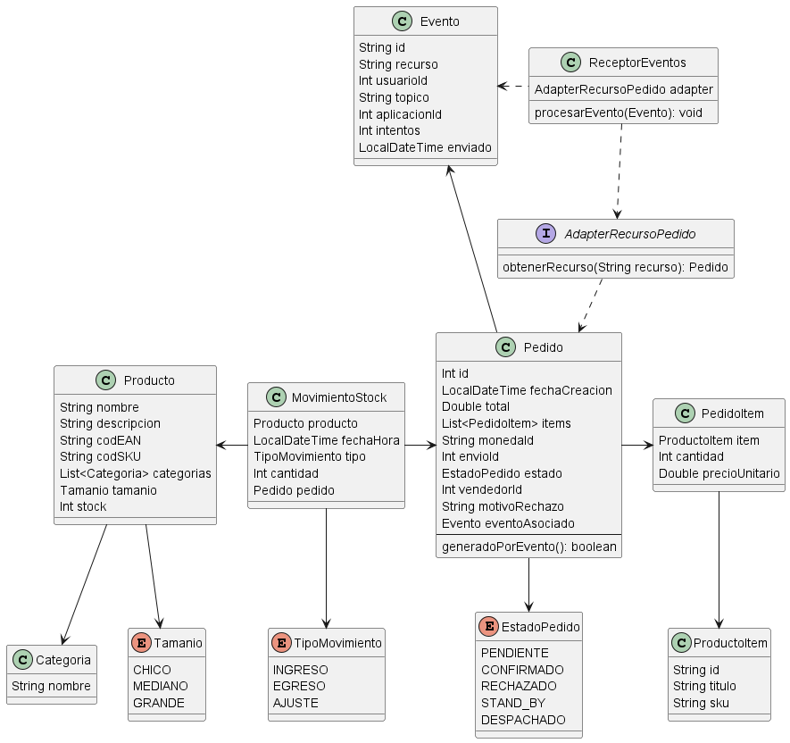
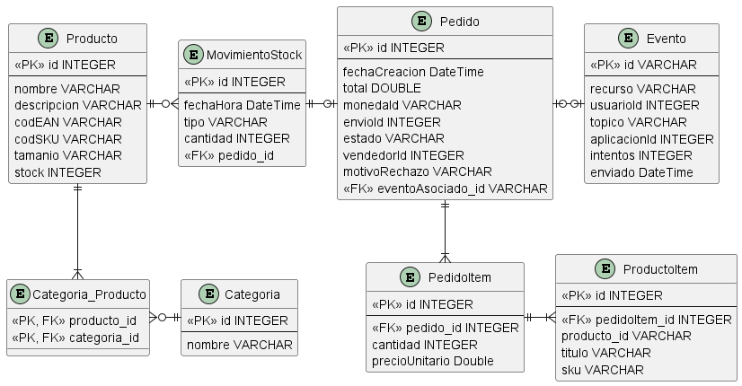

# Dominio
### Modelo de dominio

### Justificaciones
- Utilizo el patrón adapter para obtener el detalle del recurso del pedido para mejorar la mantenibilidad respecto a futuros cambios en la forma en que se obtiene o la extensibilidad respecto a nuevas formas que puedan surgir
- Al recibir un Evento de MELU en el controller, creo una instancia de Evento para pasársela al ReceptorEventos
- El AdapterRecursoPedido devuelve una instancia de la clase Pedido con varios atributos completados con los datos del servicio, pero datos como el eventoAsociado los setea el propio ReceptorEventos
- Decido que el AdapterRecursoPedido devuelva directamente un Pedido con el fin de evitar realizar mapeos de JSON en el propio receptor de eventos, mejorando la cohesión
- El MovimientoStock puede tener o no un Pedido asociado
- El método generadoPorEvento de Pedido, me permitiría facilitar la validación para saber si el empleado debe fijarse la correspondencia entre productos dados de alta por el cliente y los que generó el evento de MELU

# Persistencia
### Modelo de datos

### Justificaciones
- Almaceno los enums Tamanio, TipoMovimiento y EstadoPedido como VARCHAR para poder identificar mejor el valor que tiene cada uno en la BD, debido a que de otra forma se guardaría como número pudiendo no entender la correspondencia
- Rompo el ManyToMany entre Producto y Categoria utilizando la entidad Categoria_Producto
- La relación entre Evento y Pedido la pensé considerando que un Evento puede no corresponder a un pedido, sino a una publicación o un pago, que son features que se verían a futuro
- En la entidad Pedido, el vendedorId, envioId, monedaId no hacen referencia a tablas en particular porque son datos que me envía MELU

# Arquitectura
### 1- Procesar evento sin timeout
Para no producir un timeout en la notificación que nos envía MELU
podría implementar una cola de mensajes, de forma que apenas llega el evento,
lo agrego a la cola e inmediatamente se le responde a MELU con un 200.

Luego tendríamos un consumidor que agarraría los mensajes de la cola a medida que puede procesarlos
y haría uso de la clase ReceptorEventos

### 2- Tipo de cliente y manejo de sesión
El tipo de cliente que implementaría es un cliente pesado, para poder mantener una interfaz fluida.
Debido a que si usáramos un cliente liviano, se producirían recargas para actualizar la información ante las acciones del usuario
porque se espera obtener el HTML que venga del servidor.
Mientras que con el cliente pesado no se realizan recargas dado que no se espera un HTML del servidor, sino respuestas JSON que se
manejarán como sea necesario

Dado que voy a utilizar un cliente pesado es mejor manejar las sesiones con un servidor Stateless, de forma que el cliente
siempre envía el token JWT correspondiente a nuestra REST API para autorizar las solicitudes que realiza