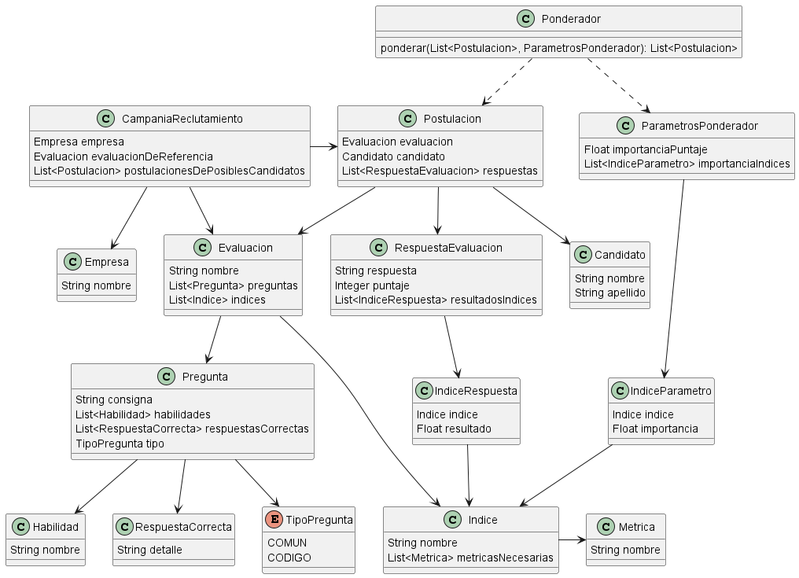

# Dominio
### 1- Diagrama de clases


### 2- Justificaciones

- El Ponderador se encarga de aplicar el ordenamiento en función a las postulaciones de los candidatos
respecto de la evaluación de referencia de la CampaniaReclutamiento.
- El puntaje de RespuestaEvaluacion es un Integer pero al crearlo se debería validar que el mismo
sólo pueda ser 0 o 1, para no tener que hacer conversiones en el Ponderador.
Inicialmente había pensado en que sea un booleano esCorrecta pero lo cambié por el motivo mencionado
- Asumo que cuando se guarde o se cree efectivamente la Postulacion, ya se habrá realizado (en la capa de controllers)
las llamadas correspondientes a los servicios que me dan los resultados para cada índice.
- Por el motivo anterior, no grafiqué el Adapter que necesitaría para obtener los resultados de los índices

### 3- Creación de nuevo Índice
Para crear un nuevo Indice en principio debería validar que el mismo esté contemplado en el sistema externo
que me brinda los resultados, y lo equivalente con el componente "Cuestionarios Frontend" respecto a la posibilidad
de obtener las métricas necesarias para ese Indice.
Luego de las validaciones, en caso de necesitar nuevas métricas se crearían y persistirían, y por último ya podría
crear el Indice correspondiente vinculándolo a las métricas necesarias

### 4- Modelado de una CampaniaReclutamiento


### 5- Generación de campaña
```java
// Desde el controller
CampaniaReclutamiento campania = repositorioCampania.buscarPorId(campaniaId)
Ponderador ponderador = new Ponderador();

List<IndiceParametro> indicesParametros = new ArrayList();
Indice indiceCopia = repositorioIndice.buscarPorNombre("Copia");
IndiceParametro indiceParametro = new IndiceParametro(indiceCopia, -1);
indicesParametros.add(indiceParametro);
ParametrosPonderador parametros = new ParametrosPonderador(
    importanciaPuntaje = 1,
    importanciaIndices = indicesParametros
);

List<Postulacion> postulacionesRecomendadas = ponderador.ponderar(postulaciones, parametros);
campania.setPostulacionesDePosiblesCandidatos(postulacionesRecomendadas);
repositorioCampania.modificar(campania)
```

# Arquitectura
#### 1- Mecanismos de integración asincrónica
Para calcular los índices de manera asincrónica se podría implementar alguno de los siguientes mecanismos

|                     | WebHook                                                                                                                                                                                                       | Cola de mensajes                                                                                                                                                                   |
|---------------------|---------------------------------------------------------------------------------------------------------------------------------------------------------------------------------------------------------------|------------------------------------------------------------------------------------------------------------------------------------------------------------------------------------|
| Eficiencia          | Mayor eficiencia debido a que procesa la respuesta del endpoint apenas se recibe                                                                                                                              | Menos eficiente debido a que se procesan las respuestas a medida que el consumidor agarra los mensajes de la cola                                                                  |
| Tolerancia a fallos | En caso de recibir un gran volumen de solicitudes, se podría caer la API REST por no poder procesarlas todas al mismo tiempo, perdiendo además otras respuestas que podrían llegar mientras esté caida la API | Es más tolerante a fallows debido a que el consumidor va procesando los mensajes de la cola a medida que pueda, evitando que se caiga por el gran volumen de respuestas a procesar |

### 2- Picos de reclutamiento en determinados momentos del año
Una posible solución es utilizar mecanismos de escalado horizontal, debido a que un escalado vertical del CPU resulta muy limitante respecto de cuánto podemos escalar.
Además, nos resulta mucho más económico optar por agregar más servidores.
Para la implementación del escalado horizontal, deberíamos utilizar un Balanceador de Carga, el cual se encargará de distribuir
las solicitudes hacia cada servidor de manera que no se saturen


### 3- Futura interfaz gráfica
Se podría implementar utilizando:
- Cliente liviano
  - Brinda una carga mucho menor en el cliente, debido a que las vistas se renderizan en el servidor, de forma que los datos necesarios para completar las vistas están mucho más cerca, pudiendo acceder a ellos con una gran velocidad
  - Resulta más dificil de mantener debido a que la lógica visual y de negocio están muy acopladas, de forma que implementar un cliente pesado a futuro se podría volver inviable
- Cliente liviano con el Front separado de la lógica de negocio
  - Si bien mantiene una carga reducida en el cliente como la otra alternativa, dicha carga resulta un poco más lenta debido a que se deben consultar los datos a la REST API que exponga nuestro componente Evaluador
  - Resulta mucho más sencillo de mantener que la otra alternativa, debido a que se mantuvo desacoplada la lógica visual y de negocio, por lo que podrían escalar de manera independiente. Y si a futuro se necesitara un cliente pesado, el cambio resultaría mucho más sencillo que con la otra alternativa
