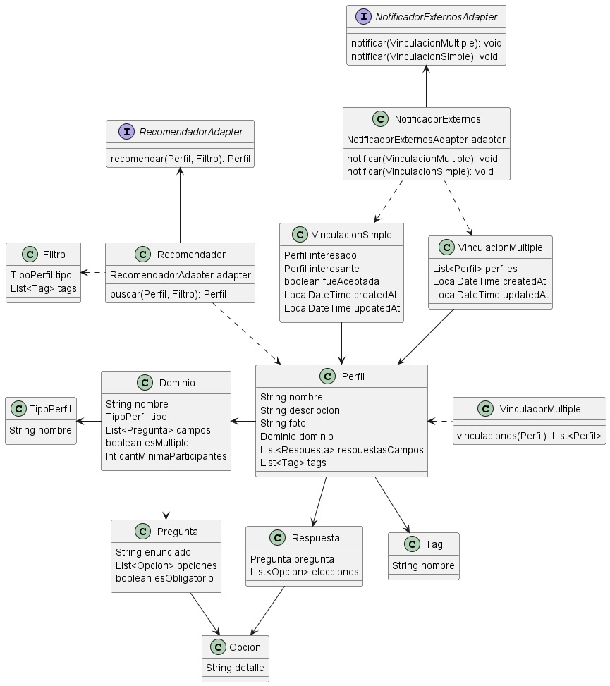
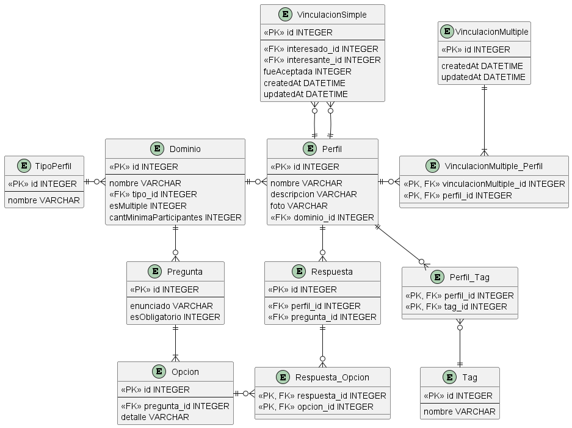

# Arquitectura
### 1- Demora de recomendaciones por DB
Asumiendo que el punto de falla es la DB por el volumen de operaciones de lectura, una alternativa para solucionar el problema
es implementar la estrategia de replicación de BD, manteniendo una enfocada únicamente en escritura y varias que replican sus datos y sólo se usarán para lecturas,
agregando además un balanceador de carga para que las solicitudes de lectura se distribuyan eficientemente a cada DB réplica.

### 2- Broker de mensajes
Las plataformas externas se suscribirían a un tópico del Broker donde nuestro vinculador va a agregar mensajes, y el broker simplemente publica el mensaje en el tópico correspondiente,
y al estar suscritas las plataformas externas, éstas terminan recibiendo el mensaje porque están a la escucha de ese tópico.

Este método de integración con plataformas externas funcionará siempre y cuando el broker esté funcionando y las plataformas externas no se desuscriban del tópico donde el Vinculador envía mensajes

### 3- Adapter para envío de mensajes
Considero que es una alternativa válida, dado que me permite a futuro poder cambiar la forma o el medio en que se envían los mensajes.
Manteniendo clases cohesivas y un código desacoplado de la lógica de mensajería

# Dominio
### 1- Diagrama de clses


### 2- Justificaciones
- Utilizo el patrón Adapter tanto para el recomendador como para el notificador externos, debido a que además de proporcionarme cohesividad y mantenibilidad, no conozco la implementación que se va a querer realizar, por lo que dejamos definida la firma para que a futuro se implemente
- Guardo los tipos de perfil que existen en una tabla a parte para luego poder buscar por éstos en los filtros del recomendador, lo mismo para las tags
- Asumo que no hay respuestas libres para las preguntas, por lo que sólo quedan con la lista de opciones y otro atributo para saber si es obligatoria.
- Si bien el enunciado me da a entender que sólo se va a tener una opción elegida en cada pregunta como máximo, lo mantengo como una lista de elecciones (opciones elegidas) por si llega a cambiar y se admiten opciones de selección múltiple

### 3- Integraciones contra otros sistemas
En el diagrama las integracinoes contra otros sistemas/plataformas la podemos ver en la clase NotificadorExternos, de forma que cada vez que la capa de controllers genera una nueva vinculación,
ya sea simple o múltiple, utiliza el NotificadorExternos para enviar la notificación a cada plataforma suscrita. Además implemento el patrón Adapter por si a futuro se podría llegar a cambiar la notificación
y dejar de ser por medio de un broker de mensajes

### 4- Pseudo implementación - Creación de perfil y like
```java
// Creción de un perfil
RepositorioDominio repositorioDominio = new RepositorioDominio();
RepositorioPerfil repositorioPerfil = new RepositorioPerfil();

Dominio startup = repositorioDominio.buscar("startup");
Perfil perfil = new Perfil();
perfil.setNombre("Pepito");
perfil.setDescripcion("Una descripción");
perfil.setDominio(startup);

// Like
Int interesadoId = 1;
Int interesanteId = 2;

RepositorioVinculacionSimple repositorioVinculacionSimple = new RepositorioVinculacionSimple();

Perfil perfilInteresado = repositorioPerfil.buscarPorId(interesadoId);
Perfil perfilInteresante = repositorioPerfil.buscarPorId(interesanteId);

// Los atributos fueAceptada, createdAt y updatedAt se setean en el constructor
VinculacionSimple vinculacion = new VinculacionSimple();
vinculacion.setInteresado(perfilInteresado);
vinculacion.setInteresante(perfilInteresante);

repositorioVinculacionSimple.guardar(vinculacion)
```

# Persistencia


### Justificaciones
- 
