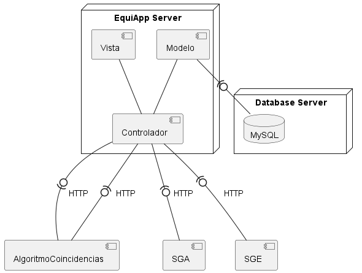
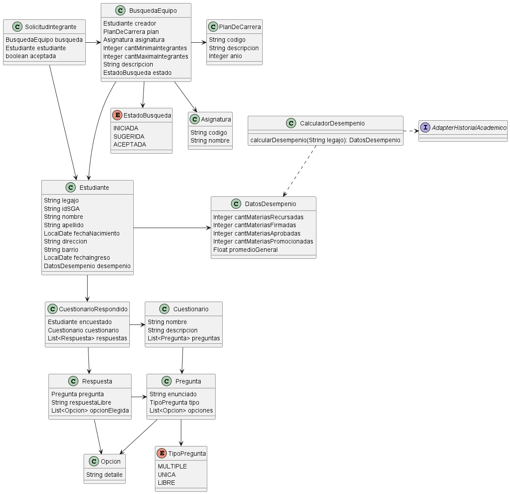
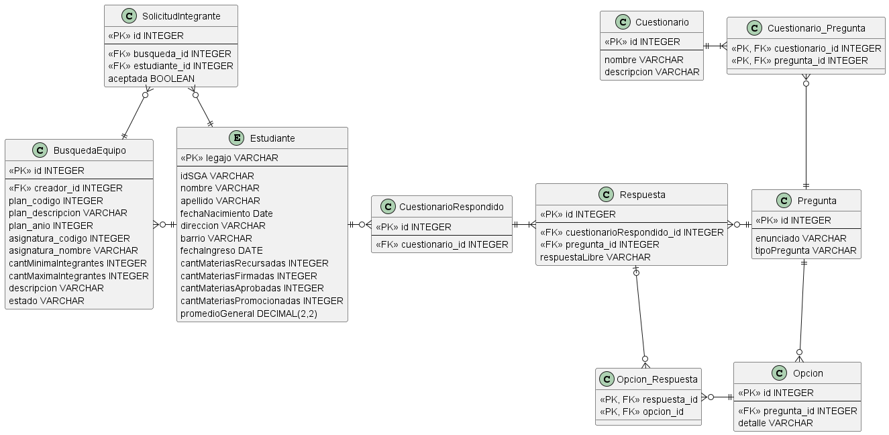

# Arquitectura
### 1- Diagrama de despliegue


### 2- Componentes a exponer
Debemos exponer una API REST con un endpoint para recibir la respuesta del WebHook del componente AlgoritmoCoincidencias
- Solicitud: POST /busqueda/resultados
- Cuerpo:
```json
{
  "busqueda_id": "a5a3dc16-bb57-4d32-84a3-20b08e21a6c3",
  "fecha_generacion": "16/12/2023",
  "resultados": [
    {
      "id_resultado": "efdaa412-36d2-4cfe-bbdf-5826aac9bc6f",
      "estudiantes": [
        "d3411930-4cfc-47a9-ae31-c21a6bba0c73",
        "5ff763f2-3486-4e64-b9a4-22b703015578",
        "87d00f8c-a970-4378-a0ca-04d33d526660"
      ]
    }
  ]
}
```
...

### 3- Manejo de TimeOut para el envío de notificaciones
Realizaría el envío de la notificación utilizando un mecanismo asincrónico
como puede ser una cola de mensajes, de forma que agrego una notificación a la cola
y brindo respuesta inmediatamente después al sistema externo que me brinda los resultados.
Además debería tener un Job que actúe de consumidor procesando las notificaciones de la cola
a medida que pueda

# Modelo de Dominio
### Diagrama de clases


### Justificaciones

- No se presenta adapters para obtener los datos personales
porque se asume que se haría en la capa de Controllers, al hacer el registro de estudiante
- Se utiliza el TipoPregunta para poder realizar validaciones cuando el Estudiante responda los cuestionarios
de forma que si es LIBRE, la respuesta se guarda en el atributo respuestaLibre y si es una o varias se guarda en una lista de opciones
- El CalculadorDeDesempenio obtiene el HistorialAcademico por medio del AdapterHistorialAcademico
que internamente realizaría la llamada al endpoint correspondiente del SGA


# Persistencia
### Modelo de datos


### Justificaciones

- Se embebe la clase DatosDesempenio debido a que se forma una relación 1 a 1 donde seguramente no necesite obtener solo los datos sin el alumno
- Sí se persisten el plan de carrera y la asignatura porque se debe poder enviar listas de éstas,
para que el estudiante pueda elegir entre opciones existentes
- Los enums EstadoBusqueda y TipoPregunta se almacenarán como strings en las clases que las contienen, con la anotación @Enumerated
