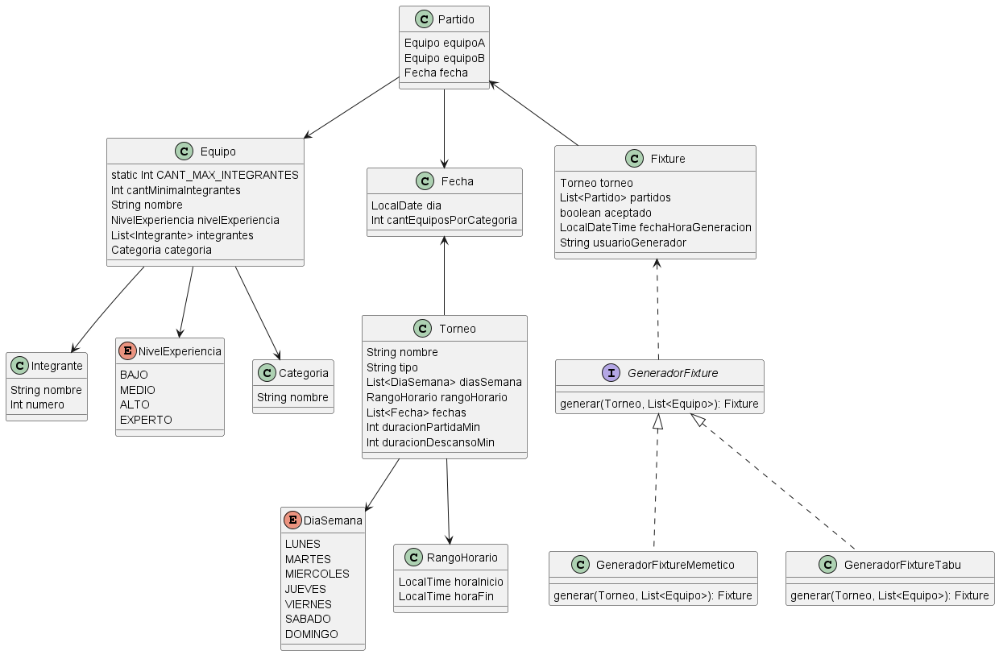
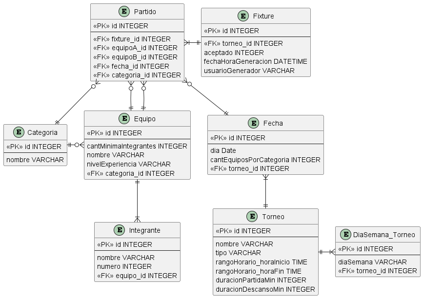

# Modelo de dominio

### Justificaciones
- Aplico el patrón Strategy en el GeneradorFixture de forma que se puedan utilizar distintos algoritmos de generación, simplemente manteniendo la misma firma del método `generar`, cada algoritmo implementaría su propia "estrategia". Esto me brinda extensibilidad, mantenibilidad y cohesión
- El NivelExperiencia queda como enum porque no tiene una frecuencia de cambio relevante, y actualmente aparenta ser informativo/sin comportamiento
- Establezco la cantidad máxima de integrantes como static para que aplique a cualquier equipo del sistema, y como la mínima es variable, queda como atributo
- Defino un enum DiaSemana para poder seleccionar días de semana válidos y existentes al setearlos en la clase Torneo. Y es conveniente tenerlo como enum porque probablemente nunca cambie
- El Fixture generado guarda un string como usuarioGenerador, si bien considero que debería ser una clase, no tengo el contexto para determinarla, a lo sumo podría agregar una clase Usuario y que sólo tenga el nombre

### Soporte a otros deportes
En este modelo no haría falta ningún cambio en particular, debido a que no está fuertemente acoplado al contexto de Kayak Polo

# Persistencia

### Justificaciones
- Los impedance mismatch de los enums de mi dominio los almaceno como VARCHAR almacenando el valor que tenga cada uno, usando la anotación @Enumerated o un @Converter si llegara a necesitar parsear el string
- Tuve que crear una entidad DiaSemana_Torneo para resolver el @OneToMany que existe de torneo a DiaSemana en mi dominio, pero el valor diaSemana se sigue guardando como VARCHAR según el valor del enum
- Embebo el rango horario en el torneo para evitar una relación @OneToOne innecesaria, evitando así hacer un JOIN extra sólo para obtener esos datos
- Considero desnormalizar Partido por performance almacenando directamente la fk a Categoria sin tener que ir primero a alguno de los equipos para luego hacer el join correspondiente
- El estado de "aceptado" se guarda como INTEGER en el Fixture, pero de forma que 0 es false y 1 es true, para resolver el impedance mismatch que surge al querer guardar un booleano en un motor de BD que no lo acepta

# Arquitectura
### Integración con sistema de resultados y estadísticas
En caso de simplemente necesitar conocer el fixture generado, puedo exponer una API REST con un endpoint `/fixture/{torneoId}`.
Donde retornaría los datos del fixture que se eligió para ese torneo. Es una alternativa sencilla y estandarizada de exponer información por el protocolo HTTP

### Optimización de base de datos con alta concurrencia
Utilizaría una estrategia de replicación de bases de datos, donde tenemos una única BD que se encarga de las escrituras en la misma,
y mantenemos otras BD de lectura que repliquen los datos de la de escritura. De esta manera se puede manejar independientemente la escritura y la lectura
logrando que en momentos de alta concurrencia en operaciones de lectura, las operaciones de escritura no se vean afectadas.
Incluso se podría llegar a utilizar un load balancer para distribuir las operaciones de lectura a las distintas BD réplica evitando que se saturen
