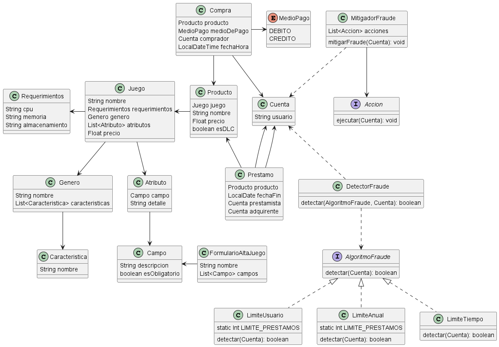
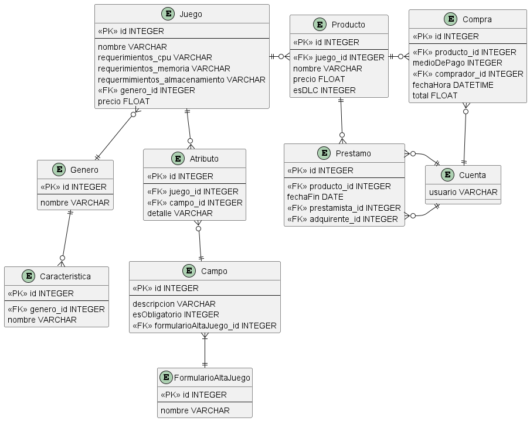

# Arquitectura
### Visualización de catálogo offline
Considero que la implementación de un CDN no tiene nada que ver con una posible solución al problema.
En su lugar probablemente optaría por implementar un cliente pesado. De forma que no será necesario
siempre consultar al servidor los juegos comprados, sino que se pueden guardar en la caché/storage del cliente.

### Escalabilidad maximizando la disponibilidad
Dado que ya se intentó hacer un escalado vertical, ahora optaría por un escalado horizontal para servir la API REST.
De esta forma, tendríamos varios servidores corriendo la misma app, y un balanceador de carga distribuiría las solicitudes HTTP
a cada servidor asegurándose de que no se saturen.

### Facturación de compras
Debido a que el proceso de facturación es el punto de falla en las compras, podemos implementar una generación de facturas asincrónica,
tal vez utilizando una cola de mensajes, para que se pueda confirmar la compra inmediatamente y la factura se le podría enviar por correo
al usuario una vez que esté lista.

# Modelo de dominio

### Justificaciones
- Los juegos base se manejan con la clase Juego, pero tanto los juegos como los DLC se manejan en una misma clase Producto que mantiene una referencia al Juego correspondiente
- Los requerimientos quedan en una clase a parte sólo para que estén encapsulados a nivel dominio, pero en el modelo de datos Requerimientos se embebe
- Cada género tiene un listado de características definido por los administradores del sistema
- Realizo el modelo de pregunta/respuesta para el FormularioAltaJuego y Campo / Atributo. Considerando que las respuestas "detalle" son libres
- De la compra al momento sólo almaceno el MedioPago con el que se hizo, podría utilizarse también una clase que incluya el número de tarjeta, pero lo consideré mejor así al momento
- Utilizo el patrón Strategy para el DetectorFraude de forma que para detectar si una cuenta comete fraude. La capa de controller le pasaría una instancia del algoritmo con el que quiere verificar y la cuenta a detectar
- El MitigadorFraude utiliza un patrón Command donde, si la capa de Controller sabe que hubo fraude, manda a ejecutar las acciones configuradas del Mitigador, y cada Accion debe cumplir con la interfaz Accion para que podamos configurar diversas implementaciones concretas de acciones

### Mecanismo anti-fraudes
Lo resolvería en gran parte en la capa de Controller, donde voy a hacer uso de las clases DetectorFraude y MitigadorFraude.
Primero, para detectar si hubo fraude instancio un DetectorFraude y utilizo su método de detectar para cada Algoritmo o para los necesarios/sospechosos.
Si me arroja false, entonces no hago nada, pero si detecta que sí hubo fraude, le envío la Cuenta que lo cometió al MitigadorFraude para que ejecute las acciones configuradas

# Persistencia

### Justificaciones
- Embebo los Requerimientos en Juego para eliminar el OneToOne que se generaba
- Mapeo el enum de MedioPago como un INTEGER correspondiente al valor de cada key del enum
- El booleano esDLC se convierte a INTEGER debido a que no todas las DB manejan booleanos. En este caso queda 0=false y 1=true
