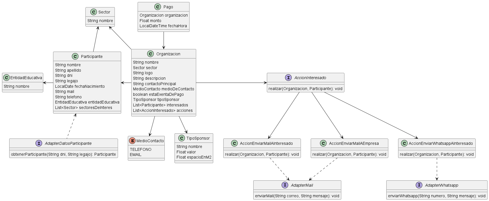
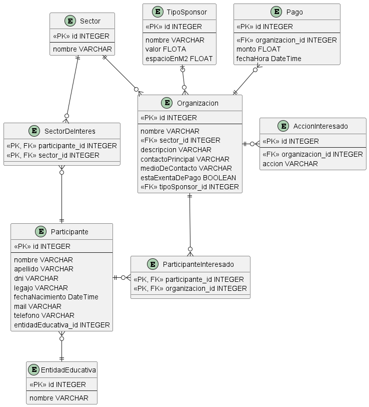

# Modelo de dominio
### 1- Diagrama de clases

### 2- Justificaciones

# Persistencia
### 1- Modelo de datos

### 2- Justificaciones

# Arquitectura
### 1- Gestión de cambio de pasarela de pago
...

### 2- Acciones asincrónicas con fecha/hora determinada
Podría persistir las acciones pendientes de realizar y utilizar un CronJob.
El CronJob se podría ejecutar cada 5 min y realizar las acciones pendientes cuya fecha/hora haya pasado

### 3- Reutilización de componente de entradas a eventos
Utilizaría una cola de mensajes para realizar esta integración asincrónica, porque si es un componente nuestro el que vamos a reutilizar,
podemos hacer que actúe como consumidor de la cola para que procese la generación de entradas a medida que su capacidad de procesamiento lo permita.
Además, si bien la otra alternativa es utilizar un WebHook, esto supondría tener que exponer 2 API REST, una para el componente de generación de entradas
y otro para nuestro componente de registro, lo que podría resultar incluso más complejo y menos eficiente que la cola de mensajes.
La integración se haría de forma que al registrarse correctamente a un Participante, se agregaría un mensaje a la cola, luego tendríamos nuestro componente
de generación de entradas actuando como consumidor, procesando los mensajes de la cola a medida que se agregan y que su capacidad lo permita.