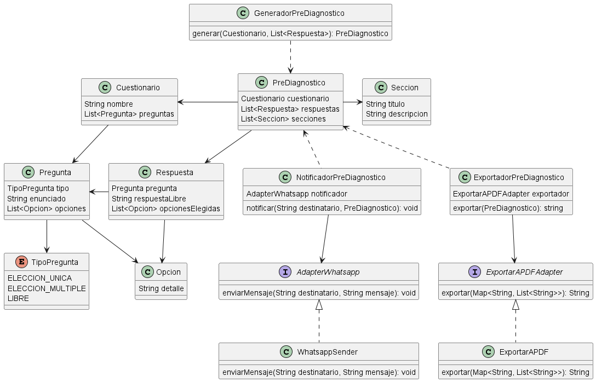
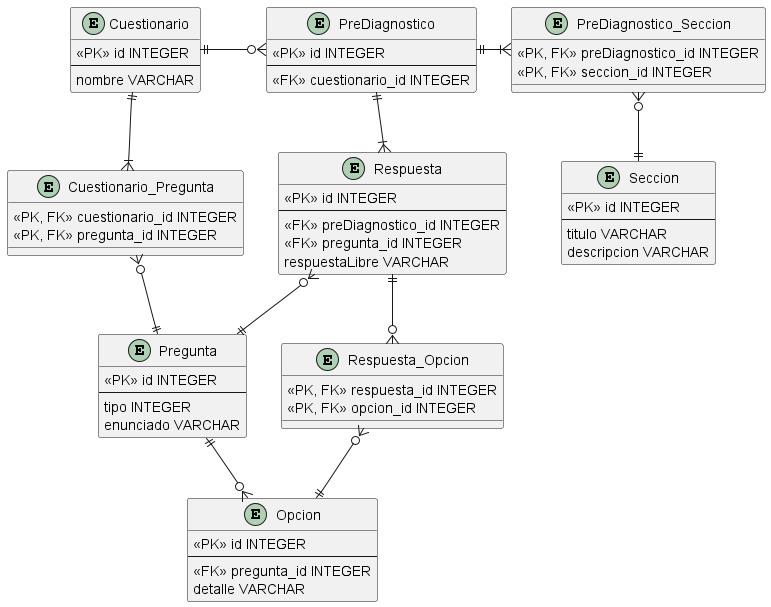

# Modelo de Dominio

### Justificaciones
- Utilizo el patrón Adapter tanto para el envío de Whatsapp como para la exportación a PDF, para poder cambiar a futuro la implementación concreta por el uso de alguna librería diferente, si es que fuera necesario, manteniéndome así desacoplado y con una alta cohesión
- Si bien creo Adapters para el envío de Whatsapp como para la exportación a PDF no los llevé al nivel extra que podría ser AdapterNotificacion para que se puedan implementar otros medios (correo por ej) o manejar exportaciones a otros tipos de archivos más que sólo PDF. Esto es debido a que considero que en esta etapa no resulta necesario, además de que si se necesitara ese cambio no sería muy complicado realizarlo debido a que sólo se ven afectadas 2 clases en cada caso y sólo sería un cambio del Tipo que se utiliza
- Dentro de la clase Respuesta contemplo las respuestas para todo tipo de preguntas, siendo que respuestaLibre sólo se utilizaría si el tipo de pregunta fuera LIBRE, y lo equivalente para opcionesElegidas, que sólo se utilizaría si el tipo de pregunta fuera ELECCION_UNICA o ELECCION_MULTIPLE
- Doy la posibilidad de tener distintos cuestionarios a lo largo del tiempo para generar el PreDiagnóstico, motivo por el cual GeneradorPreDiagnostico recibe tanto el cuestionario como la lista de respuestas que dio el usuario
- Brindo la posibilidad de a futuro poder saber qué cuestionario y qué respuestas llevaron a un PreDiagnostico al resultado que tuvo, por eso guardo tanto el Cuestionario como las Respuestas en el PreDiagnostico

# Persistencia

### Justificaciones
- Se persisten las Preguntas guardando el `tipo` como un INTEGER correspondiente al valor del enum que tenemos en el sistema
- Considero que las opciones no necesitan ser reutilizables para otras preguntas, por lo que cada Opcion está directamente relacionada a una Pregunta
- Considero que sería conveniente poder reutilizar Preguntas en nuevos cuestionarios que se puedan crear, por lo que rompo el ManyToMany con la entidad Cuestionario_Pregunta
- Debido a que las Respuestas, de preguntas que tenían Opciones, deben identificar la Opción elegida me genera un ManyToMany el cual rompo con la entidad Respuesta_Opcion
- Un conjunto de respuestas es lo que termina generando al PreDiagnostico, por lo que consideré que cada Respuesta va directamente relacionada al PreDiagnostico generado a partir de estas
- Debido a que debo permitir el ABM de Secciones, las persisto de forma que se puedan reutilizar, manteniendo un ManyToMany entre PreDiagnostico y Seccion, el cual se rompe con la entidad PreDiagnostico_Seccion

# Arquitectura
### Minimizar costos de Chat GPT
Una alternativa podría ser almacenar las respuestas de las solicitudes, y cuando se quiera generar un prediagnóstico
verificar si existe alguna que corresponda al mismo cuestionario y tenga las mismas respuestas, si las tiene genero el
prediagnóstico con el mismo detalle de la solicitud encontrada, y si no realizo la solicitud y la persisto para futuras consultas.
No creo que esta alternativa las minimice al máximo, pero sí reduciría el número de consultas

### Evitar Time Out
Podría implementar una cola de mensajes para que la generación de prediagnósticos se realice de manera asincrónica,
mientras que al usuario le respondemos inmediatamente con un 200, por detrás tendremos un consumidor que agarrará los
mensajes de esa cola y los procesará para generar los prediagnósticos pendientes
