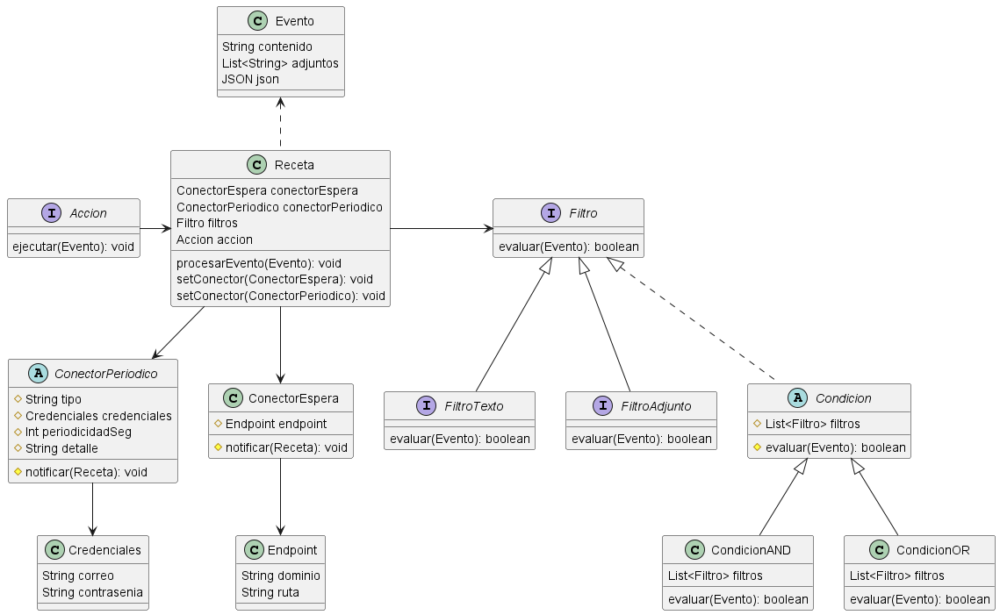

# Arquitectura
### 1- Diagrama de despliegue

### 2- Reutilización de conectores
Tal vez podría tener un componente que se encargue de validar si el conector que se quiere crear/utilizar ya fue creado o se está utilizando.
En caso de que la respuesta sea positiva, vincularía la Receta a dicho conector para que, al producirse un evento, el controller
se fije qué recetas están vinculadas a tal conector y que mande a ejecutar las acciones puestas en las respectivas recetas

# Dominio

### Justificaciones
- La receta mantiene atributos para guardar un ConectorEspera y un ConectorPeriodico, pero para evitar tener 2 conectores para una misma receta lo validaría dentro del método setConector, que utiliza sobrecarga de métodos para poder recibir un tipo de conector u otro
- La receta va a hacer uso del Evento que inicialmente es generado por el conector cuando ejecuta su método `notificar` y se lo pasa al método de `procesarEvento` de la Receta
- El Evento puede tener un atributo contenido determinado por un conector concreto, o si se tratase de un ConectorEspera, no tendría contenido pero sí llenaría el atributo json
- Se utiliza el patrón Composite y Decorator para poder implementar filtros complejos utilizando las Condiciones
- El método `notificar(Receta)` de los conectores me permite poder reutilizarlos si varios usuarios quisieran observar los mismos, de forma que en la capa de Controller es donde se verifica qué Recetas escuchan al Conector que lanzó un Evento y utilizan el método `notificar` para que cada Receta ejecute las acciones correspondientes

# Persistencia

### Justificaciones
- Los conectores periódicos se almacenarian mediante una estrategia Single Table para manejar la herencia respecto a los conectores periódicos concretos
- Lo anterior no aplica para los conectores de espera, porque sólo necesitan conocer el dominio y la ruta del endpoint que escuchan
- Los datos de las credenciales y del endpoint para las entidades correspondientes se embeben para evitar la relación OneToOne además de que no es relevante buscar solo las credenciales o sólo los endpoints utilizados
- Las acciones se almacenarían con un VARCHAR que identifique a la clase concreta que implementa la interfaz Accion y a la que está vinculada la Receta. Si hubiera sido una lista de acciones habría necesitado crear una nueva tabla
- Evento y Adjunto quedan por separado debido a que no están directamente relacionados con el resto, o al menos no en el modelo de datos, aunque una posible vinculación podría ser que Evento tenga una FK hacia la Receta a la que corresponde, pero no estaba seguro porque siento que complejiza mi implementación en el dominio
- Los filtros tienen el campo `tipo` el cual será un VARCHAR definido por un Converter que pueda convertir las implementaciones concretas a strings que las identifiquen o poner la palabra "COMPUESTO" para saber que se tiene que ir a buscar las condiciones de la compoisición a la tabla de Condicion
- Para Condicion sucede algo similar a filtros donde se resuelve el impedance mismatch de almacenar las implementaciones concretas de la clase Condicion, guardando en `tipo` valores como "AND" y "OR"

### Integración con sistema de facturación
Para los datos que necesita el sistema de facturación, podría agregar a la tabla Evento los campos de `usuario_id` y `demoraSeg`.
Luego el sistema externo podrá hacer consultas respecto a los datos de los eventos procesados.